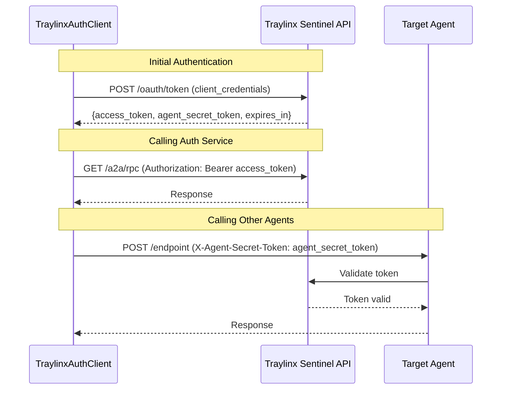

# Traylinx Auth Client (Node.js)

[](https://badge.fury.io/js/%40traylinx%2Fauth-client)
[](https://nodejs.org/)
[](https://opensource.org/licenses/MIT)

A robust, enterprise-grade Node.js library for Traylinx Sentinel Agent-to-Agent (A2A) authentication. This client provides secure token management, automatic retry logic, comprehensive error handling, and seamless integration with Express.js applications.

## 🚀 Features

- **🔐 Dual Token Authentication**: Handles both `access_token` and `agent_secret_token` with automatic refresh
- **🛡️ Enterprise Security**: Input validation, secure credential handling, and comprehensive error management
- **⚡ High Performance**: Connection pooling, automatic retries with exponential backoff, and efficient token caching
- **🔄 Async/Await Ready**: Modern JavaScript with Promise-based API and full async/await support
- **🎯 Express.js Integration**: Simple middleware for protecting endpoints with A2A authentication
- **📡 JSON-RPC Support**: Full support for A2A RPC method calls with automatic credential detection
- **🔧 Zero Configuration**: Works with environment variables out of the box
- **📊 Production Ready**: Configurable logging, monitoring, and comprehensive error handling

## 📦 Installation

### Using npm

```bash
npm install traylinx-auth-client
```

### Using Yarn

```bash
yarn add traylinx-auth-client
```

### Requirements

- Node.js 14.0 or higher
- `axios` >= 0.21.0
- `uuid` >= 8.0.0
- `joi` >= 17.0.0

## ⚡ Quick Start (5 lines)

```javascript
const { makeA2ARequest } = require('traylinx-auth-client');

// Set environment variables: TRAYLINX_CLIENT_ID, TRAYLINX_CLIENT_SECRET, 
// TRAYLINX_API_BASE_URL, TRAYLINX_AGENT_USER_ID

// Make authenticated request to another agent
const response = await makeA2ARequest('GET', 'https://other-agent.com/api/data');
console.log(response); // JSON response from the agent
```

## 🔧 Configuration

### Environment Variables

Set these environment variables for your agent:

```bash
export TRAYLINX_CLIENT_ID="your-client-id"
export TRAYLINX_CLIENT_SECRET="your-client-secret"  
export TRAYLINX_API_BASE_URL="https://auth.traylinx.com"
export TRAYLINX_AGENT_USER_ID="12345678-1234-1234-1234-123456789abc"
```

### Programmatic Configuration

```javascript
const { TraylinxAuthClient } = require('traylinx-auth-client');

const client = new TraylinxAuthClient(
    'your-client-id',
    'your-client-secret',
    'https://auth.traylinx.com',
    '12345678-1234-1234-1234-123456789abc',
    {
        timeout: 30000,        // Request timeout in milliseconds
        maxRetries: 3,         // Maximum retry attempts
        retryDelay: 1000,      // Base delay between retries
        cacheTokens: true,     // Enable token caching
        logLevel: 'INFO'       // Logging level
    }
);
```

## 📖 Usage Examples

### Making Authenticated Requests

#### Simple Function Approach

```javascript
const { makeA2ARequest } = require('traylinx-auth-client');

// GET request
const data = await makeA2ARequest('GET', 'https://other-agent.com/api/users');

// POST request with JSON data
const result = await makeA2ARequest('POST', 'https://other-agent.com/api/process', {
    json: { items: ['item1', 'item2'] },
    timeout: 60000
});

// PUT request with custom headers
const response = await makeA2ARequest('PUT', 'https://other-agent.com/api/update/123', {
    json: { status: 'completed' },
    headers: { 'X-Custom-Header': 'value' }
});
```

#### Manual Header Management

```javascript
const { getAgentRequestHeaders } = require('traylinx-auth-client');
const axios = require('axios');

// Get headers for calling other agents
const headers = await getAgentRequestHeaders();

// Make authenticated request
const response = await axios.get('https://other-agent.com/api/data', { headers });

// Headers include:
// {
//     "X-Agent-Secret-Token": "your-agent-secret-token",
//     "X-Agent-User-Id": "your-agent-user-id"
// }
```

### Protecting Express.js Endpoints

#### Simple Middleware Approach

```javascript
const express = require('express');
const { requireA2AAuth } = require('traylinx-auth-client');

const app = express();

app.get('/protected', requireA2AAuth, (req, res) => {
    res.json({ message: 'This endpoint requires A2A authentication' });
});

app.post('/process', requireA2AAuth, (req, res) => {
    // This endpoint is automatically protected
    res.json({ processed: req.body });
});
```

#### Manual Validation

```javascript
const express = require('express');
const { validateA2ARequest } = require('traylinx-auth-client');

const app = express();

app.post('/manual-validation', async (req, res) => {
    try {
        const isValid = await validateA2ARequest(req.headers);
        if (!isValid) {
            return res.status(401).json({ error: 'Invalid A2A token' });
        }
        
        res.json({ message: 'Token is valid' });
    } catch (error) {
        console.error('Validation error:', error);
        res.status(500).json({ error: 'Authentication service unavailable' });
    }
});
```

#### Dual Authentication Support (A2A + Bearer)

```javascript
const { requireDualAuth, detectAuthMode } = require('traylinx-auth-client');

app.get('/flexible-auth', requireDualAuth, (req, res) => {
    // Supports both Bearer tokens and custom headers
    const authMode = detectAuthMode(req.headers);
    res.json({ authMode, message: 'Authenticated successfully' });
});
```

## 🔧 Advanced Usage

### Using the Client Directly

```javascript
const { TraylinxAuthClient } = require('traylinx-auth-client');

// Create client with custom configuration
const client = new TraylinxAuthClient(
    'client-id',
    'client-secret', 
    'https://auth.traylinx.com',
    'agent-user-id',
    {
        timeout: 60000,
        maxRetries: 5,
        retryDelay: 2000
    }
);

// Get individual tokens
const accessToken = await client.getAccessToken();
const agentSecretToken = await client.getAgentSecretToken();

// Get different header types
const authHeaders = await client.getRequestHeaders();      // For auth service calls
const agentHeaders = await client.getAgentRequestHeaders(); // For agent calls
const a2aHeaders = await client.getA2AHeaders();           // A2A-compatible format

// Validate incoming tokens
const isValid = await client.validateToken('incoming-token', 'sender-agent-id');
```

### JSON-RPC Method Calls

```javascript
const { TraylinxAuthClient } = require('traylinx-auth-client');

const client = new TraylinxAuthClient();

// Built-in RPC methods
const result = await client.rpcIntrospectToken('token-to-validate', 'agent-id');
const capabilities = await client.rpcGetCapabilities();
const health = await client.rpcHealthCheck();

// Custom RPC calls
const response = await client.rpcCall(
    'custom_method',
    { param1: 'value1' },
    'https://custom-agent.com/a2a/rpc'
);

// RPC call with explicit credential control
const response = await client.rpcCall(
    'auth_service_method',
    {},
    null, // Use default auth service URL
    false // Uses only access_token
);
```

### Error Handling

```javascript
const {
    TraylinxAuthClient,
    AuthenticationError,
    NetworkError,
    ValidationError,
    TokenExpiredError
} = require('traylinx-auth-client');

try {
    const client = new TraylinxAuthClient(
        'invalid-id',
        'invalid-secret'
    );
    const response = await client.rpcHealthCheck();
    
} catch (error) {
    if (error instanceof ValidationError) {
        console.error(`Configuration error: ${error.message}`);
        console.error(`Error code: ${error.code}`);
        
    } else if (error instanceof AuthenticationError) {
        console.error(`Authentication failed: ${error.message}`);
        console.error(`Status code: ${error.statusCode}`);
        
    } else if (error instanceof NetworkError) {
        console.error(`Network error: ${error.message}`);
        if (error.code === 'TIMEOUT') {
            console.error('Request timed out - check network connectivity');
        } else if (error.code === 'RATE_LIMIT') {
            console.error('Rate limited - retry after delay');
        }
        
    } else if (error instanceof TokenExpiredError) {
        console.error(`Token expired: ${error.message}`);
        // Token will be automatically refreshed on next request
    }
}
```

### Concurrent Usage

```javascript
const { TraylinxAuthClient } = require('traylinx-auth-client');

// Thread-safe client usage
const client = new TraylinxAuthClient();

async function workerFunction(workerId) {
    try {
        // Each async function can safely use the same client
        const headers = await client.getAgentRequestHeaders();
        const response = await makeA2ARequest('GET', `https://api.com/data/${workerId}`);
        console.log(`Worker ${workerId}:`, response);
    } catch (error) {
        console.error(`Worker ${workerId} error:`, error);
    }
}

// Create multiple concurrent requests
const promises = [];
for (let i = 0; i < 10; i++) {
    promises.push(workerFunction(i));
}

// Wait for all requests to complete
await Promise.all(promises);
```

## 📚 Complete API Reference

### Core Functions

#### `makeA2ARequest(method, url, options) -> Promise<Object>`

Make an authenticated A2A request to another agent.

**Parameters:**
- `method` (string): HTTP method (GET, POST, PUT, DELETE, etc.)
- `url` (string): Target agent's URL
- `options` (Object, optional): Additional options for axios

**Returns:**
- `Promise<Object>`: JSON response from the target agent

**Throws:**
- `NetworkError`: For network-related issues
- `AuthenticationError`: For authentication failures
- `ValidationError`: For invalid parameters

**Example:**
```javascript
const response = await makeA2ARequest('POST', 'https://agent.com/api', {
    json: { key: 'value' }
});
```

#### `getRequestHeaders() -> Promise<Object>`

Returns headers for calling the auth service (includes access_token).

**Returns:**
```javascript
{
    "Authorization": "Bearer <access_token>",
    "X-Agent-Secret-Token": "<agent_secret_token>",
    "X-Agent-User-Id": "<agent_user_id>"
}
```

#### `getAgentRequestHeaders() -> Promise<Object>`

Returns headers for calling other agents (ONLY agent_secret_token).

**Returns:**
```javascript
{
    "X-Agent-Secret-Token": "<agent_secret_token>",
    "X-Agent-User-Id": "<agent_user_id>"
}
```

#### `getA2ARequestHeaders() -> Promise<Object>`

Returns A2A-compatible headers using Bearer token format.

**Returns:**
```javascript
{
    "Authorization": "Bearer <agent_secret_token>",
    "X-Agent-User-Id": "<agent_user_id>"
}
```

#### `requireA2AAuth(req, res, next)`

Express.js middleware that protects endpoints with A2A authentication.

**Parameters:**
- `req` (Object): Express request object
- `res` (Object): Express response object  
- `next` (Function): Express next function

**Example:**
```javascript
app.get('/protected', requireA2AAuth, (req, res) => {
    res.json({ message: 'Protected' });
});
```

#### `requireDualAuth(req, res, next)`

Enhanced middleware supporting both Bearer tokens and custom headers.

#### `validateA2ARequest(headers) -> Promise<boolean>`

Validates incoming A2A request headers (custom format).

**Parameters:**
- `headers` (Object): Request headers

**Returns:**
- `Promise<boolean>`: True if valid, false otherwise

#### `validateDualAuthRequest(headers) -> Promise<boolean>`

Validates incoming requests supporting both Bearer tokens and custom headers.

#### `detectAuthMode(headers) -> string`

Detect authentication mode from request headers.

**Returns:**
- `string`: 'bearer', 'custom', or 'none'

### TraylinxAuthClient Class

#### Constructor

```javascript
new TraylinxAuthClient(
    clientId,           // OAuth client ID
    clientSecret,       // OAuth client secret
    apiBaseUrl,         // Traylinx API base URL
    agentUserId,        // Agent user UUID
    options = {}        // Additional configuration
)
```

**Parameters:**
- All parameters default to corresponding environment variables
- `options.timeout` (number): Request timeout in milliseconds (default: 30000)
- `options.maxRetries` (number): Maximum retry attempts (default: 3)
- `options.retryDelay` (number): Base retry delay in milliseconds (default: 1000)
- `options.cacheTokens` (boolean): Enable token caching (default: true)
- `options.logLevel` (string): Logging level - DEBUG, INFO, WARN, ERROR (default: "INFO")

**Throws:**
- `ValidationError`: If configuration parameters are invalid

#### Token Management Methods

##### `getAccessToken() -> Promise<string>`

Get current access token for calling auth service.

**Returns:**
- `Promise<string>`: Valid access token

**Throws:**
- `TokenExpiredError`: If token is unavailable
- `AuthenticationError`: If token fetch fails

##### `getAgentSecretToken() -> Promise<string>`

Get current agent secret token for agent-to-agent communication.

**Returns:**
- `Promise<string>`: Valid agent secret token

**Throws:**
- `TokenExpiredError`: If token is unavailable
- `AuthenticationError`: If token fetch fails

#### Header Generation Methods

##### `getRequestHeaders() -> Promise<Object>`

Get headers for calling the auth service (includes access_token).

##### `getAgentRequestHeaders() -> Promise<Object>`

Get headers for calling other agents (ONLY agent_secret_token).

##### `getA2AHeaders() -> Promise<Object>`

Get A2A-compatible authentication headers using Bearer token format.

#### Validation Methods

##### `validateToken(agentSecretToken, agentUserId) -> Promise<boolean>`

Validate an agent secret token against the auth service.

**Parameters:**
- `agentSecretToken` (string): Token to validate
- `agentUserId` (string): Agent user ID associated with token

**Returns:**
- `Promise<boolean>`: True if token is valid and active

**Throws:**
- `AuthenticationError`: If validation request fails
- `NetworkError`: For network-related issues

##### `validateA2ARequest(headers) -> Promise<boolean>`

Validate A2A request supporting both Bearer tokens and custom headers.

##### `detectAuthMode(headers) -> string`

Detect authentication mode from request headers.

#### JSON-RPC Methods

##### `rpcCall(method, params, rpcUrl, includeAgentCredentials) -> Promise<Object>`

Make a JSON-RPC call with automatic credential detection.

**Parameters:**
- `method` (string): RPC method name
- `params` (Object): RPC method parameters
- `rpcUrl` (string, optional): Custom RPC endpoint URL
- `includeAgentCredentials` (boolean, optional): Whether to include agent credentials

**Returns:**
- `Promise<Object>`: JSON-RPC response

**Throws:**
- `ValidationError`: For invalid RPC requests or parameters
- `AuthenticationError`: For authentication failures
- `NetworkError`: For network issues
- `TraylinxAuthError`: For RPC-specific errors

##### `rpcIntrospectToken(agentSecretToken, agentUserId) -> Promise<Object>`

Introspect a token via JSON-RPC.

##### `rpcGetCapabilities() -> Promise<Object>`

Get agent capabilities via JSON-RPC.

##### `rpcHealthCheck() -> Promise<Object>`

Perform health check via JSON-RPC.

### Error Classes

#### `TraylinxAuthError`

Base error class for all TraylinxAuthClient errors.

**Properties:**
- `code` (string): Specific error code
- `statusCode` (number): HTTP status code (if applicable)

#### `ValidationError extends TraylinxAuthError`

Thrown for input validation failures.

#### `AuthenticationError extends TraylinxAuthError`

Thrown for authentication-related failures.

#### `TokenExpiredError extends TraylinxAuthError`

Thrown when tokens are expired or unavailable.

#### `NetworkError extends TraylinxAuthError`

Thrown for network-related issues (timeouts, connection errors, etc.).

## 🔐 Authentication Flow

### Dual Token System

Traylinx uses a dual-token authentication system for enhanced security:

1. **`access_token`**: Used for calling Traylinx auth service endpoints
2. **`agent_secret_token`**: Used for agent-to-agent communication

### Authentication Process



### Token Usage Matrix

| Scenario | access_token | agent_secret_token | Headers |
|----------|--------------|-------------------|---------|
| **Auth service calls** | ✅ Required | ❌ Not used | `Authorization: Bearer <access_token>` |
| **Agent-to-agent calls** | ❌ Not used | ✅ Required | `X-Agent-Secret-Token: <agent_secret_token>` |
| **A2A compatible calls** | ❌ Not used | ✅ Required | `Authorization: Bearer <agent_secret_token>` |
| **Token validation** | ✅ Required | ❌ Not used | `Authorization: Bearer <access_token>` |

### Automatic Token Management

1. **Token Acquisition**: Automatically fetches tokens using OAuth2 `client_credentials` grant
2. **Token Caching**: Tokens cached in memory with automatic expiration handling
3. **Automatic Refresh**: Expired tokens refreshed automatically before requests
4. **Error Recovery**: Handles token expiration and authentication failures gracefully

**Example token response:**
```json
{
    "access_token": "eyJhbGciOiJSUzI1NiIsInR5cCI6IkpXVCJ9...",
    "agent_secret_token": "TqlJuJi5aJa7lz8rg9zWjbRDChND8m9PMr4bsn...",
    "token_type": "Bearer",
    "expires_in": 7200,
    "scope": "a2a"
}
```

## 🛡️ Error Handling & Resilience

### Comprehensive Error Management

The client provides robust error handling with specific error types:

```javascript
const {
    TraylinxAuthError,      // Base error
    ValidationError,        // Configuration/input validation
    AuthenticationError,    // Authentication failures  
    TokenExpiredError,      // Token expiration
    NetworkError           // Network/connectivity issues
} = require('traylinx-auth-client');
```

### Automatic Retry Logic

- **Exponential Backoff**: Automatic retries with increasing delays
- **Configurable Retries**: Set `maxRetries` and `retryDelay` options
- **Smart Retry Logic**: Only retries on transient failures (429, 5xx errors)
- **Connection Management**: Efficient connection reuse for better performance

### Error Scenarios Handled

| Error Type | HTTP Status | Retry | Description |
|------------|-------------|-------|-------------|
| `ValidationError` | 400 | ❌ | Invalid configuration or parameters |
| `AuthenticationError` | 401 | ❌ | Invalid credentials or expired tokens |
| `NetworkError` (Rate Limit) | 429 | ✅ | Rate limiting - automatic retry with backoff |
| `NetworkError` (Timeout) | 408 | ✅ | Request timeout - configurable retry |
| `NetworkError` (Server Error) | 5xx | ✅ | Server errors - automatic retry |
| `NetworkError` (Connection) | 0 | ✅ | Connection failures - automatic retry |

### Production Monitoring

```javascript
const { TraylinxAuthClient, NetworkError } = require('traylinx-auth-client');

const client = new TraylinxAuthClient();

try {
    const response = await client.rpcHealthCheck();
} catch (error) {
    if (error instanceof NetworkError) {
        if (error.code === 'RATE_LIMIT') {
            console.warn(`Rate limited: ${error.message}`);
            // Implement backoff strategy
        } else if (error.code === 'TIMEOUT') {
            console.error(`Request timeout: ${error.message}`);
            // Check network connectivity
        } else {
            console.error(`Network error: ${error.message}`);
        }
    }
}
```

## 🔒 Security Best Practices

### Credential Management

✅ **DO:**
- Store credentials in environment variables or secure vaults
- Use different credentials for different environments (dev/staging/prod)
- Regularly rotate client credentials
- Monitor authentication failures and unusual patterns
- Use HTTPS for all communications

❌ **DON'T:**
- Hard-code credentials in source code
- Log sensitive data (tokens, secrets, passwords)
- Share credentials between different applications
- Use production credentials in development/testing

### Secure Configuration

```javascript
// ✅ Good: Use environment variables
const client = new TraylinxAuthClient(); // Reads from env vars

// ✅ Good: Use secure credential management
const client = new TraylinxAuthClient(
    process.env.TRAYLINX_CLIENT_ID,
    await getSecret('traylinx_client_secret'),
    process.env.TRAYLINX_API_BASE_URL,
    process.env.TRAYLINX_AGENT_USER_ID
);

// ❌ Bad: Hard-coded credentials
const client = new TraylinxAuthClient(
    'hardcoded-id',      // Never do this!
    'hardcoded-secret'   // Never do this!
);
```

### Network Security

- **TLS/HTTPS**: All communications use HTTPS with certificate validation
- **Request Signing**: Tokens provide request authenticity
- **Timeout Protection**: Configurable timeouts prevent hanging requests
- **Rate Limiting**: Built-in protection against rate limiting

### Logging Security

```javascript
// ✅ Safe logging - no sensitive data
console.log('Authentication successful for agent', agentUserId);
console.error('Authentication failed with status', response.status);

// ❌ Unsafe logging - exposes sensitive data
console.log('Token:', accessToken);        // Never log tokens!
console.debug('Secret:', clientSecret);    // Never log secrets!
```

## 🔧 Troubleshooting

### Common Issues

#### Authentication Failures

**Problem**: `AuthenticationError: Invalid credentials`

**Solutions:**
1. Verify environment variables are set correctly
2. Check clientId and clientSecret are valid
3. Ensure API base URL is correct
4. Verify agentUserId is a valid UUID

```bash
# Check environment variables
echo $TRAYLINX_CLIENT_ID
echo $TRAYLINX_CLIENT_SECRET  
echo $TRAYLINX_API_BASE_URL
echo $TRAYLINX_AGENT_USER_ID
```

#### Network Issues

**Problem**: `NetworkError: Connection failed`

**Solutions:**
1. Check network connectivity to API endpoint
2. Verify firewall/proxy settings
3. Increase timeout value
4. Check DNS resolution

```javascript
// Test connectivity
const axios = require('axios');
const response = await axios.get('https://your-api-base-url/health');
console.log(response.status);
```

#### Configuration Errors

**Problem**: `ValidationError: Configuration validation failed`

**Solutions:**
1. Ensure agentUserId is a valid UUID format
2. Verify API base URL is a valid HTTPS URL
3. Check all required parameters are provided

```javascript
// Validate UUID format
const { validate: isUUID } = require('uuid');
console.log(isUUID('your-agent-user-id')); // Should be true
```

#### Token Issues

**Problem**: `TokenExpiredError: Token is not available`

**Solutions:**
1. Check if initial authentication succeeded
2. Verify network connectivity during token refresh
3. Check if credentials are still valid

### Debug Mode

```javascript
// Enable debug logging
const client = new TraylinxAuthClient(
    clientId,
    clientSecret,
    apiBaseUrl,
    agentUserId,
    { logLevel: 'DEBUG' }
);
// This will show detailed request/response information
```

### Performance Optimization

```javascript
// Optimize for high-throughput scenarios
const client = new TraylinxAuthClient(
    clientId,
    clientSecret,
    apiBaseUrl,
    agentUserId,
    {
        timeout: 60000,        // Longer timeout for slow networks
        maxRetries: 5,         // More retries for reliability
        retryDelay: 500,       // Faster initial retry
        cacheTokens: true      // Enable token caching
    }
);
```

## ❓ FAQ

### Q: What's the difference between access_token and agent_secret_token?

**A:** The `access_token` is used for calling Traylinx auth service endpoints, while `agent_secret_token` is used for agent-to-agent communication. They serve different purposes in the dual-token authentication system.

### Q: How do I handle token expiration?

**A:** Token expiration is handled automatically. The client will refresh tokens before they expire and retry failed requests with fresh tokens.

### Q: Can I use the same client instance across multiple requests?

**A:** Yes! The client is designed for reuse and can safely handle multiple concurrent requests. Token management is handled internally.

### Q: How do I customize retry behavior?

**A:** Use the `maxRetries` and `retryDelay` options:

```javascript
const client = new TraylinxAuthClient(
    clientId, clientSecret, apiBaseUrl, agentUserId,
    {
        maxRetries: 5,      // Retry up to 5 times
        retryDelay: 2000    // Start with 2-second delay
    }
);
```

### Q: What happens if the auth service is down?

**A:** The client will retry requests with exponential backoff. If all retries fail, it will throw a `NetworkError` with details about the failure.

### Q: How do I validate incoming requests in my Express app?

**A:** Use the `requireA2AAuth` middleware or `validateA2ARequest()` function:

```javascript
app.post('/endpoint', requireA2AAuth, (req, res) => {
    res.json({ status: 'authenticated' });
});
```

## 🚀 Development

### Setting Up Development Environment

```bash
# Clone the repository
git clone https://github.com/traylinx/traylinx-auth-client-js.git
cd traylinx-auth-client-js

# Install dependencies
npm install

# Run tests
npm test

# Run tests with coverage
npm run test:coverage

# Run linting
npm run lint

# Run type checking (if TypeScript definitions exist)
npm run type-check
```

### Running Tests

```bash
# Run all tests
npm test

# Run tests with coverage report
npm run test:coverage

# Run specific test file
npm test -- --testPathPattern=client.test.js

# Run tests in watch mode
npm test -- --watch

# Run tests with verbose output
npm test -- --verbose
```

### Code Quality

```bash
# Lint code with ESLint
npm run lint

# Fix linting issues automatically
npm run lint:fix

# Security audit
npm audit

# Check for outdated dependencies
npm outdated
```

### Building and Publishing

```bash
# Check package contents
npm pack --dry-run

# Test publish to npm (dry run)
npm publish --dry-run

# Publish to npm
npm publish --access public
```

### Project Structure

```
traylinx_auth_client_js/
├── src/
│   ├── index.js             # Public API exports and high-level functions
│   ├── client.js            # Core TraylinxAuthClient class
│   ├── validation.js        # Input validation with Joi
│   └── errors.js            # Custom error hierarchy
├── tests/
│   ├── client.test.js       # Client class tests
│   ├── validation.test.js   # Validation tests
│   ├── errors.test.js       # Error handling tests
│   └── index.test.js        # High-level function tests
├── package.json             # Project configuration and dependencies
├── README.md                # This file
├── CHANGELOG.md             # Version history
├── CONTRIBUTING.md          # Contribution guidelines
├── SECURITY.md              # Security policy
└── LICENSE                  # MIT license
```

### Adding New Features

1. **Create Feature Branch**: `git checkout -b feature/new-feature`
2. **Write Tests First**: Add tests in appropriate test file
3. **Implement Feature**: Add implementation with proper JSDoc comments
4. **Update Documentation**: Update README and JSDoc comments
5. **Run Quality Checks**: Ensure tests pass and code quality is maintained
6. **Submit Pull Request**: Include description of changes and test results

### Testing Guidelines

- **Unit Tests**: Test individual functions and methods
- **Integration Tests**: Test end-to-end authentication flows
- **Error Tests**: Test all error conditions and edge cases
- **Mock External Services**: Use mocks for HTTP requests to auth service
- **Async Safety Tests**: Test concurrent access patterns

## 🤝 Contributing

We welcome contributions! Please see [CONTRIBUTING.md](CONTRIBUTING.md) for detailed guidelines.

### Quick Contribution Guide

1. **Fork the repository** on GitHub
2. **Clone your fork** locally
3. **Create a feature branch** from `main`
4. **Make your changes** with tests
5. **Run the test suite** to ensure everything works
6. **Submit a pull request** with a clear description

### Contribution Types

- 🐛 **Bug Fixes**: Fix issues and improve reliability
- ✨ **New Features**: Add new functionality
- 📚 **Documentation**: Improve docs and examples
- 🔧 **Performance**: Optimize performance and efficiency
- 🧪 **Tests**: Add or improve test coverage
- 🎨 **Code Quality**: Refactoring and code improvements

### Code Standards

- Follow JavaScript Standard Style guidelines
- Add JSDoc comments for all public functions
- Write comprehensive tests for new features
- Maintain test coverage above 90%
- Use meaningful variable and function names

## 📄 License

This project is licensed under the MIT License - see the [LICENSE](LICENSE) file for details.

### MIT License Summary

- ✅ Commercial use allowed
- ✅ Modification allowed  
- ✅ Distribution allowed
- ✅ Private use allowed
- ❌ No warranty provided
- ❌ No liability accepted

## 🆘 Support & Community

### Getting Help

- 📖 **Documentation**: [Traylinx Developer Docs](https://docs.traylinx.com)
- 🐛 **Bug Reports**: [GitHub Issues](https://github.com/traylinx/traylinx-auth-client-js/issues)
- 💬 **Discussions**: [GitHub Discussions](https://github.com/traylinx/traylinx-auth-client-js/discussions)
- 📧 **Email Support**: dev@traylinx.com

### Reporting Issues

When reporting issues, please include:

1. **Node.js version** and operating system
2. **Library version** (`npm list traylinx-auth-client`)
3. **Minimal code example** that reproduces the issue
4. **Full error stack trace** if applicable
5. **Expected vs actual behavior**

### Feature Requests

We welcome feature requests! Please:

1. Check existing issues to avoid duplicates
2. Describe the use case and problem you're solving
3. Provide examples of how the feature would be used
4. Consider contributing the implementation

### Security Issues

For security-related issues, please follow our [Security Policy](SECURITY.md):

- 🔒 **Private Disclosure**: Email security@traylinx.com
- ⏱️ **Response Time**: We aim to respond within 24 hours
- 🛡️ **Responsible Disclosure**: We follow coordinated disclosure practices

---

**Made with ❤️ by the Traylinx Team**

[](https://github.com/traylinx/traylinx-auth-client-js)
[](https://www.npmjs.com/package/traylinx-auth-client)
[](https://github.com/traylinx/traylinx-auth-client-js/graphs/contributors)
